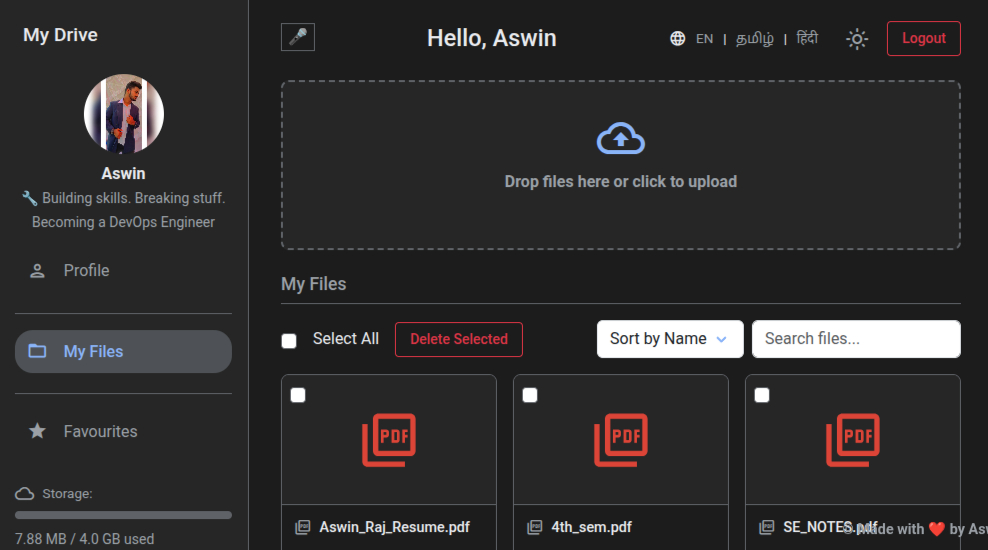
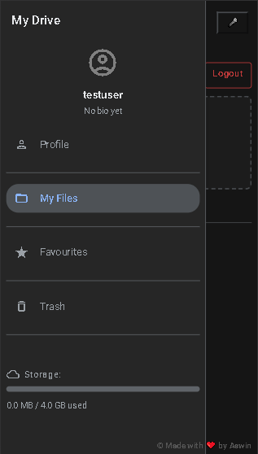
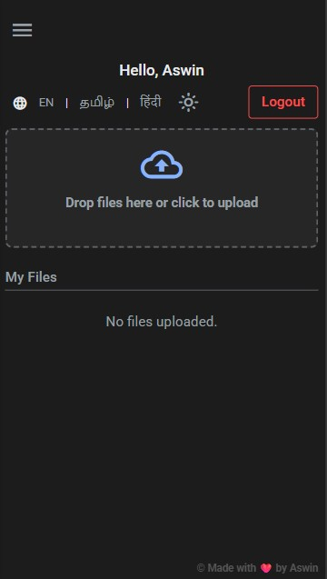

#  MiniGDrive

**MiniGDrive** is a lightweight cloud storage application built using Flask and SQLite, designed to mimic the basic functionality of Google Drive. Users can register, log in, upload, download, and manage their files — all within a simple and secure environment.

---

## 📸 Screenshot

Dashboard(PC view):



Dashboard(mobile view):

 

---

## 🌐 Live Demo

👉 [](https://tinyurl.com/MyminiGDriveAR)


---

## 🚀 Features

- **User Registration and Login**: Secure authentication with password hashing.  
- **File Management**: Upload, download, and delete files.  
- **Trash System**: Deleted files are moved to a trash folder for recovery.  
- **Personal Storage Management**: Monitor storage usage with a progress bar.  
- **Session Management**: Auto-expiry of sessions after 7 days.  
- **Profile Customization**: Update bio, age, and profile picture.

---

## 🛠️ Tech Stack

| Layer                | Technology Used                                                   | Purpose                                         |
|----------------------|-------------------------------------------------------------------|-------------------------------------------------|
| **Backend**          | Python + Flask                                                    | Web server and application logic                |
| **Database**         | SQLite                                                            | Storing user accounts and profiles              |
| **Frontend**         | HTML (Flask templates), Bootstrap 5, Vanilla JavaScript           | Responsive UI, modals, sorting/filtering, interactivity |
| **Security**         | Werkzeug (secure filename + password hashing)                     | Secure file uploads and password management     |
| **File Handling**    | Python libraries (`os`, `shutil`, `zipfile`, `uuid`, `unicodedata`)| File operations (uploads, storage, trash)      |
| **Session Management** | Flask + `datetime`                                              | Managing user sessions (login duration)         |
| **Deployment**       | AWS EC2                                                           | Hosting the application                         |
| **Containerization** | Docker                                                            | Packaging and running the app                   |
| **CI/CD**            | GitHub Actions                                                    | Automating tests and deployment                 |


---

## 📂 Project Structure

```plaintext
MiniGDrive/
│
├── app.py                # Main Flask application
├── users.db              # SQLite DB (created at runtime)
├── test_app.py           # Unit tests
├── templates/            # HTML templates
│   ├── index.html
│   ├── login.html
│   ├── logo.html
│   ├── profile.html
│   └── register.html
├── uploads/             # Uploaded files (generated)
├── trash/               # Trashed files (generated)
├── storage/             # User storage dir (generated)
└── static/              # Static assets (profile images, etc.)
```

---

## ⚙️ How to Run Locally

1. **Clone the repository**:
   ```bash
   git clone https://github.com/Aswin-AR5055/MiniGDrive.git
   cd MiniGDrive
   ```

2. **Install the dependencies**(use a virtual environment):

   ```bash
   pip install -r requirements.txt
   ```
   **Note**:requirements.txt file is included

3. **Run the application**:
   ```bash
   python app.py
   ```
   OR:
   
    ```bash
   python3 app.py
   ```
   
5. **Visit the application**:
   Open your browser and navigate to (or) copy paste the address shown on terminal when you run the app:

   ```bash
   http://127.0.0.1:5000 

   ```

   ---

## 🛳️ Run with Docker

If you have Docker installed, you can run MiniGDrive without installing dependencies manually.

1. **Clone the repository**:
   ```bash
   git clone https://github.com/Aswin-AR5055/MiniGDrive.git
   cd MiniGDrive
   ```

2. **Build the Docker image**:
   ```bash
   docker build -t minigdrive .
   ```

3. **Run the container**:
   ```bash
   docker run -p 5000:5000 minigdrive
   ```


4. **Access the application**:
   
   Open your browser and go to:
   ```
   http://localhost:5000   #localhost is the local machine's address
   ```

---

## 🔒 Security Notes

- **Password Security**: Passwords are hashed securely before being stored in the database using Werkzeug.  
- **Session Management**: Session tokens ensure users stay logged in securely for up to 7 days.
- **Important:** For your safety, **do not use your real personal email address or password** when registering on this site. Use a secondary or disposable email, and a       unique password that you do not use elsewhere.

---

## 🙏 Acknowledgements

Lead Development and DevOps handled by [Aswin Raj A](https://www.instagram.com/ar_aswinraj)

Design Support by [Mohamed Suhail S](https://github.com/octatrix008)

Built with ❤️  


