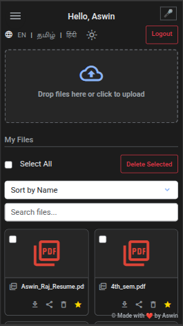

#  MiniGDrive          


**MiniGDrive** is a lightweight, responsive cloud storage application powered by Flask + SQLite, now with voice command support. Users can register, log in, upload, download, and manage files — all within a clean and intuitive UI.

---

## 📑 Table of Contents

- [Screenshots](#screenshots)
- [Live Demo](#live-demo)
- [Features](#features)
- [ER Diagram](#entity-relationshiper-diagram)
- [Tech Stack](#tech-stack)
- [Project Structure](#project-structure)
- [Voice Commands Supported](#voice-commands-supported)
- [How to Run Locally](#how-to-run-locally)
- [Run with Docker](#run-with-docker)
- [Deployment Pipeline](#deployment-pipeline)
- [Security Notes](#security-notes)
- [License](#license)
- [Acknowledgements](#acknowledgements)

---

## Screenshots

Dashboard (PC view):


Dashboard (Mobile view):

 


---

## Live Demo

[](https://d2r6fbb0wu8aqt.cloudfront.net)
> **Hosted:** AWS EC2 instance using Docker and GitHub Actions  
> **Secured via:** CloudFront CDN (HTTPS)  
> **Note:** This is a demo site. Please avoid uploading sensitive or personal data.  
> **Disclaimer:** I am not responsible for any data theft, loss, or misuse.

---

## Features

- **Voice Command Support**: 
Use browser-based voice commands, hands-free interaction powered by Web Speech API.
- **User Registration and Login**: Secure authentication with password hashing.
- **File Upload and Download**: Users can upload and download files easily.
- **Trash System**: Deleted files go to trash instead of being permanently removed.
- **Restore and Permanent Delete**: Restore files from trash or delete them forever.
- **Bulk Actions**: Select multiple files to delete, restore, or download as ZIP.
- **Storage Monitoring**: View used storage with a visual progress bar.
- **Responsive UI**: Works well on both desktop and mobile screens.
- **Profile Customization**: Add bio, age, and profile picture.
- **Multilingual Support**: UI available in English, Tamil, and Hindi.

---

## Entity Relationship(ER) Diagram


## Tech Stack

| Layer                  | Technology Used                                                   | Purpose                                               |
|------------------------|-------------------------------------------------------------------|-------------------------------------------------------|
| **Backend**            | Python + Flask                                                    | Web server and application logic                      |
| **Database**           | SQLite                                                            | Storing user accounts and profiles                    |
| **Frontend**           | HTML (Flask templates), Bootstrap 5, Vanilla JavaScript, Web Speech API           | Responsive UI, modals, voice commands, sorting/filtering, interactivity |
| **Security**           | Werkzeug (secure filename + password hashing)                     | Secure file uploads and password management           |
| **File Handling**      | Python libraries (`os`, `shutil`, `zipfile`, `uuid`, `unicodedata`)| File operations (uploads, storage, trash)            |
| **Session Management** | Flask + `datetime`                                                | Managing user sessions (login duration)               |
| **Hosting**            | AWS EC2                                                           | Server for running the app                            |
| **HTTPS/CDN**          | AWS CloudFront                                                    | Secure global access over HTTPS with CDN caching      |
| **Containerization**   | Docker                                                            | Packaging and running the app                         |
| **CI/CD**              | GitHub Actions                                                    | Automating tests and deployment                       |

---

## Project Structure

```plaintext
MiniGDrive/
│
├── .github/workflows/pytest-update-ec2.yml   # GitHub Actions workflow file
├── Dockerfile            # Docker configuration
├── requirements.txt      # Python dependencies
├── assets/               # Logo and Screenshots
├── app.py                # Main Flask application
├── users.db              # SQLite DB (created at runtime)
├── test_app.py           # Unit tests
├── templates/            # HTML templates
│   ├── index.html
│   ├── login.html
│   ├── logo.html
│   ├── profile.html
│   └── register.html
├── uploads/             # Uploaded files (generated)
├── trash/               # Trashed files (generated)
├── storage/             # User storage dir (generated)
└── static/              # Static assets (profile images, etc.)
```

---

## Voice Commands Supported

Below are the voice commands you can use in **MiniGDrive**:

| Command Example                            | Action                                      |
|--------------------------------------------|---------------------------------------------|
| `upload file`                              | Open file upload dialog                     |
| `delete file [filename]`                   | Delete the specified file                   |
| `list files`                               | Highlight/list all files                    |
| `logout` / `log me out` / `sign out`       | Log out of your account                     |
| `trash` / `go to trash` / `view/open/show trash` | Go to Trash page                    |
| `go to dashboard` / `view/open dashboard`  | Go to Dashboard page                        |
| `go to profile` / `view/open profile`      | Go to Profile page                          |
| `switch language to english`               | Change app language to English              |
| `switch language to tamil`                 | Change app language to Tamil                |
| `switch language to hindi`                 | Change app language to Hindi                |
| `switch to dark mode` / `enable dark mode` | Switch to Dark Mode                         |
| `switch to light mode` / `enable light mode`| Switch to Light Mode                        |
| `search for [filename]`                    | Search for a file by name                   |
| `favourites` / `open/view/show my favourites` | Go to Favourites page                    |

> 🔎 **Note:** Replace `[filename]` with the actual file name, e.g., `delete file report.pdf`.


---

## How to Run Locally

1. **Clone the repository**:
   ```bash
   git clone https://github.com/Aswin-AR5055/MiniGDrive.git
   cd MiniGDrive
   ```

2. **Install the dependencies** (use a virtual environment):
   ```bash
   pip install -r requirements.txt
   ```

3. **Run the application**:
   ```bash
   python app.py
   ```
   OR:
   ```bash
   python3 app.py
   ```

4. **Visit the application**:
   ```bash
   http://127.0.0.1:5000 
   ```

---

## Run with Docker

If you have Docker installed, you can run MiniGDrive without installing dependencies manually.

1. **Clone the repository**:
   ```bash
   git clone https://github.com/Aswin-AR5055/MiniGDrive.git
   cd MiniGDrive
   ```

2. **Build the Docker image**:
   ```bash
   docker build -t minigdrive .
   ```

3. **Run the container**:
   ```bash
   docker run -p 5000:5000 minigdrive
   ```

4. **Access the application**:
   ```bash
   http://localhost:5000
   ```

---

## Deployment Pipeline

- Code pushed to `master` branch
- GitHub Actions runs unit tests
- SSH into AWS EC2 instance
- Docker image is rebuilt using latest code
- Existing container is stopped and removed
- New container is started on port 80
- Hosted securely via AWS CloudFront (HTTPS)

---

## Security Notes

- **Password Security**: Passwords are hashed securely before being stored in the database using Werkzeug.  
- **Session Management**: Session tokens ensure users stay logged in securely for up to 7 days.  
- **Important:** For your safety, **do not use your real personal email address or password** when registering on this site. Use a secondary or disposable email, and a unique password that you do not use elsewhere.

---

## License

This project is licensed under the [MIT License](LICENSE).

Feel free to use, modify, and distribute this project — just keep the license file and give proper credit.  
Built for the community, with ❤️ by [Aswin Raj](https://github.com/Aswin-AR5055).

---

## Acknowledgements

Full Stack Development and DevOps: [Aswin Raj A](https://www.instagram.com/ar_aswinraj)  
Design Suggestions: [Mohamed Suhail S](https://github.com/octatrix008)  

Built with love, sweat and coffee ☕


