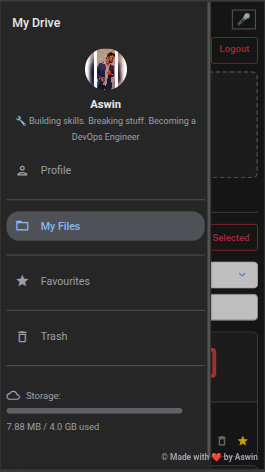

#  MiniGDrive          


**MiniGDrive** is a cloud storage web app (like a mini Google Drive) where users can sign up, log in, upload, download, and manage their files. It has a clean, responsive UI with support for voice commands and works on both desktop and mobile. This project also demonstrates my skills in full-stack development and DevOps — including databases, Docker, CI/CD pipelines, AWS deployment, and AWS S3-based file storage for better scalability.

---

## 📑 Table of Contents

- [Screenshots](#screenshots)
- [Live Demo](#live-demo)
- [Features](#features)
- [ER Diagram](#entity-relationshiper-diagram)
- [Tech Stack](#tech-stack)
- [Project Structure](#project-structure)
- [Voice Commands Supported](#voice-commands-supported)
- [How to Run Locally](#how-to-run-locally)
- [Run with Docker](#run-with-docker)
- [Deployment Pipeline](#deployment-pipeline)
- [Infrastructure Setup](#infrastructure-setup)
- [Security Notes](#security-notes)
- [License](#license)
- [Acknowledgements](#acknowledgements)

---

## Screenshots

Dashboard (PC view):


Dashboard (Mobile view):




---

## Live Demo

[](https://d3gl01gujethk4.cloudfront.net)  
> **Hosted:** AWS EC2 instance using Docker, Gunicorn, and Nginx  
> **Secured via:** CloudFront CDN (HTTPS)  
> **Note:** This is a demo site. Please avoid uploading sensitive or personal data.  
> **Disclaimer:** I am not responsible for any data theft, loss, or misuse.

---

## Features

- **Voice Command Support**: Browser-based voice commands powered by Web Speech API.  
- **User Registration and Login**: Secure authentication with password hashing.  
- **File Upload and Download (S3)**: Files are now uploaded directly to Amazon S3 with presigned URLs for secure and scalable storage.  
- **Trash System**: Deleted files are moved to a dedicated S3 trash prefix instead of being permanently removed.
- **Restore and Permanent Delete**: Restore files from trash or delete permanently (handled at the S3 object level). 
- **Bulk Actions**: Delete, restore, or download multiple files as ZIP.
- **File Sharing**: Generate secure, time-limited S3 presigned URLs to share files with others.  
- **Star Files as Favourites**: Mark important files for easy access.  
- **Optimized Static Delivery**: Static assets served via Nginx for faster loading.  
- **Storage Monitoring**: View used storage with visual progress bar.  
- **Responsive UI**: Works on both desktop and mobile.  
- **Profile Customization**: Add bio, age, and profile picture.  
- **Multilingual Support**: English, Tamil, Hindi.  
- **Monitoring**: Real-time metrics via **Prometheus + Grafana** dashboards.

---

## Entity Relationship(ER) Diagram

<div align="center">
  
</div>

---

## Tech Stack

| Layer                  | Technology Used                                                   | Purpose                                               |
|------------------------|-------------------------------------------------------------------|-------------------------------------------------------|
| **Backend**            | Python + Flask                                                    | Application logic                                     |
| **Database**           | PostgreSQL                                                            | Storing user accounts, favourite files, and profiles |
| **Frontend**           | HTML (Flask templates), Bootstrap 5, Vanilla JavaScript, Web Speech API | Responsive UI, modals, voice commands, sorting/filtering, interactivity |
| **Security**           | Werkzeug (secure filename + password hashing)                     | Secure file uploads and password management          |
| **File Storage**      | Amazon S3 (boto3 + presigned URLs) | Cloud storage for user files + trash                 |
| **Session Management** | Flask + `datetime`                                                | Managing user sessions (login duration)              |
| **Application Server** | Gunicorn                                                          | WSGI server for running the Flask app                |
| **Web Server / Proxy** | Nginx                                                             | Reverse proxy, serve static files                     |
| **Hosting**            | AWS EC2                                                           | Server for running the app                            |
| **HTTPS/CDN**          | AWS CloudFront                                                    | Secure global access over HTTPS with CDN caching     |
| **Containerization**   | Docker                                                            | Packaging and running the app                         |
| **CI/CD**              | GitHub Actions                                                    | Automating tests and deployment                       |
| **Monitoring**         | Prometheus + Grafana                                              | Metrics collection, visualization, and performance monitoring |

---

## Project Structure

```plaintext
MiniGDrive/
│
├── .github/
│   └── workflows/pytest-update-ec2.yml        # GitHub Actions workflows
├── app.py               # Main Flask application
├── db_schema.py         # Database schema definitions
├── file_utils.py        # File handling utilities
├── translations.py      # Multi-Language Support
├── routes/              # Route handlers
│   ├── __init__.py
│   ├── dashboard.py
│   ├── del_restore_permadelete.py
│   ├── download.py
│   ├── favourites.py
│   ├── home.py
│   ├── login.py
│   ├── logo.py
│   ├── permadelete.py
│   ├── profile.py
│   ├── register.py
│   ├── share.py
│   ├── star_unstar.py
│   ├── trash_del_restore.py
│   ├── trash.py
│   ├── upload.py
│   └── zip.py
├── static/             # Static assets
│   ├── login.css
│   ├── logo.css
│   ├── profile.css
│   ├── register.css
│   ├── reset_password.css
│   ├── script.js
│   ├── style.css
│   ├── voicecommands.js
│
├── templates/           # HTML templates
│   ├── favourites.html
│   ├── index.html
│   ├── login.html
│   ├── logo.html
│   ├── profile.html
│   ├── register.html
│   └── trash.html
├── assets/              # Images and logos
│   ├── ars_logo_32x32.png
│   ├── dashboard.png
│   ├── dashboardmobile.jpg
│   ├── dashboardmobile2.jpg
│   └── ER Diagram.svg
├── nginx/               #
Nginx config
    └── minigdrive.conf
├── prometheus/          #
#prometheus setup
    └── prometheus.yml

├── docker-compose.yml   # Docker compose for running multiple containers
├── Dockerfile           # Docker configuration
├── LICENSE              # LICENSE file
├── test_app.py          # Tests
└── requirements.txt     # Python dependencies 

```

---

## Voice Commands Supported

Below are the voice commands you can use in **MiniGDrive**:

| Command Example                            | Action                                      |
|--------------------------------------------|---------------------------------------------|
| `upload file`                              | Open file upload dialog                     |
| `delete file [filename]`                   | Delete the specified file                   |
| `list files`                               | Highlight/list all files                    |
| `logout` / `log me out` / `sign out`       | Log out of your account                     |
| `trash` / `go to trash` / `view/open/show trash` | Go to Trash page                    |
| `go to dashboard` / `view/open dashboard`  | Go to Dashboard page                        |
| `go to profile` / `view/open profile`      | Go to Profile page                          |
| `switch language to english`               | Change app language to English              |
| `switch language to tamil`                 | Change app language to Tamil                |
| `switch language to hindi`                 | Change app language to Hindi                |
| `switch to dark mode` / `enable dark mode` | Switch to Dark Mode                         |
| `switch to light mode` / `enable light mode`| Switch to Light Mode                        |
| `search for [filename]`                    | Search for a file by name                   |
| `favourites` / `open/view/show my favourites` | Go to Favourites page                    |

> 🔎 **Note:** Replace `[filename]` with the actual file name, e.g., `delete file report.pdf`.

---

## Deployment Pipeline

1. Push code to **master branch** triggers GitHub Actions.  
2. Automated **tests run** using pytest.  
3. SSH into **AWS EC2 instance**.  
4. Docker stack rebuilds using `docker-compose` with updated services:
   - **MiniGDrive app**
   - **PostgreSQL** Database  
   - **Prometheus** for metrics collection  
   - **Grafana** for dashboard visualization  
5. Old containers are stopped and removed.  
6. **App data volumes are preserved**; **Grafana volume** can be optionally reset for fresh dashboards.  
7. New containers start with ports exposed:
   - App: **6000**
   - Prometheus: **9090**
   - Grafana: **3000**  
8. Nginx proxies requests from **port 80 → app 6000**.  
9. **Access monitoring dashboards**:
   - Prometheus: `http://yourdomain.com:9090`
   - Grafana: `http://yourdomain.com:3000`

---

## How to Run Locally

1. **Clone the repository**:
   ```bash
   git clone https://github.com/Aswin-AR5055/MiniGDrive.git
   cd MiniGDrive
   ```

2. **Set environment variables (PostgreSQL credentials)**:
   ```bash
   export POSTGRES_DB=your_db_name
   export POSTGRES_USER=your_db_user
   export POSTGRES_PASSWORD=your_db_password

3. **Install dependencies** (virtual environment recommended):
   ```bash
   pip install -r requirements.txt
   ```

4. **Run the application**:
   ```bash
   python app.py
   ```

5. **Visit the application**:
   ```bash
   http://127.0.0.1:6000
   ```

---

## Run with Docker

1. **Build the Docker image**:
   ```bash
   docker build -t minigdrive .
   ```

2. **Run the stack with Docker Compose**:
   ```bash
   docker-compose up -d
   ```

3. **Access app and monitoring dashboards**:
   - App: `http://localhost:6000`
   - Prometheus: `http://localhost:9090`
   - Grafana: `http://localhost:3000`

---

## Infrastructure Setup

- **Terraform** provisions AWS resources.  

- **Secrets** managed securely via **GitHub Actions**.  

- **Automated provisioning** ensures consistent dev/staging/production environments.

- File storage migrated from local uploads/ + trash/ directories → Amazon S3 buckets.

- Uploads, downloads, trash, and sharing now use presigned URLs.

- CloudFront is used as CDN + HTTPS layer on top of S3-backed app.

- Infrastructure managed with Terraform + CI/CD via GitHub Actions  

---

## Security Notes

- **Password Security**: Passwords hashed via Werkzeug.  
- **Session Management**: Secure login sessions up to 7 days.  
- **Important**: Do not use personal credentials; use disposable accounts for testing.

---

## License

This project is licensed under the [MIT License](LICENSE).

Feel free to use, modify, and distribute this project — just keep the license file and give proper credit.  
Built for the community, with ❤️ by [Aswin Raj](https://github.com/Aswin-AR5055).

---

## Acknowledgements

- Full Stack Development and DevOps: [Aswin Raj A](https://www.instagram.com/ar_aswinraj)  
- Design Suggestions: [Mohamed Suhail S](https://github.com/octatrix008)  
- Built with love, sweat, and coffee ☕

